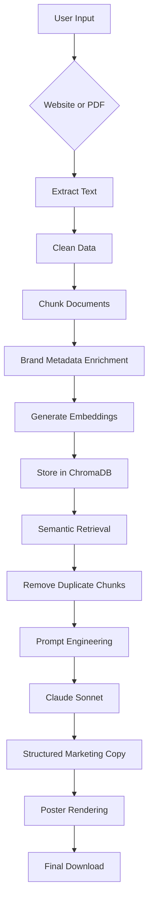

# 🚀 MarkForge AI

<p align="center">
  
</p>

<p align="center">
AI-powered Marketing Poster Generation using Retrieval-Augmented Generation (RAG), LangChain, ChromaDB, and Claude.
</p>

<p align="center">


</p>


# 📸 Demo

> Add a GIF here showing the complete workflow.

```
User enters a website URL
        ↓
Website is scraped
        ↓
Brand content is embedded
        ↓
Relevant context retrieved
        ↓
Claude generates marketing copy
        ↓
Poster rendered automatically
```

---

# 📖 Overview

**MarkForge AI** is an end-to-end **Retrieval-Augmented Generation (RAG)** application that automatically generates **brand-aware marketing posters** from either:

- 🌐 Company websites
- 📄 PDF documents

Unlike generic LLM prompting, MarkForge retrieves factual context directly from the source before generation, enabling marketing content that accurately reflects the brand's tone, messaging, and identity.

The generated content is then rendered into a professional marketing poster with brand colors, logos, headlines, descriptions, and call-to-action elements.

---

# ❗ Problem Statement

Traditional LLM prompts often generate generic marketing content such as:

> "Innovative solutions for modern businesses..."

These responses ignore the unique personality and messaging of individual brands.

MarkForge AI addresses this limitation by implementing a Retrieval-Augmented Generation pipeline that grounds every generated response in real brand content before prompting the language model.

---

# ✨ Features

## Intelligent RAG Pipeline

- Website & PDF ingestion
- Intelligent document preprocessing
- Recursive text chunking
- Brand metadata enrichment
- Dense vector embeddings
- ChromaDB vector storage
- Top-K semantic retrieval
- Duplicate chunk filtering
- Context-aware prompt construction
- Claude Sonnet response generation

---

## AI Features

- Retrieval-Augmented Generation (RAG)
- Semantic Search
- Metadata-aware Retrieval
- Prompt Engineering
- Context Grounding
- Brand Tone Detection
- Structured Output Parsing
- Multi-source Knowledge Retrieval

---

## Performance Features

- URL-scoped Vector Database
- Disk Caching
- Automatic Retry Logic
- Wikipedia Fallback
- Graceful Error Handling
- Modular Architecture
- Config-driven Design

---

## User Features

- Website URL Input
- PDF Upload Support
- Downloadable Marketing Poster
- Automatic Logo Detection
- Automatic Brand Color Detection
- Product Image Retrieval
- Professional Poster Rendering

---

# 🏗 Architecture



---

# 🔄 Complete Workflow

1. User enters a website URL or uploads a PDF.
2. Content is extracted and cleaned.
3. Text is divided into semantic chunks.
4. Brand metadata is attached to every chunk.
5. Embeddings are generated using Sentence Transformers.
6. Chunks are stored inside ChromaDB.
7. User query retrieves the most relevant chunks.
8. Duplicate chunks are removed.
9. A grounded prompt is constructed.
10. Claude Sonnet generates structured marketing content.
11. Brand assets are combined with AI-generated text.
12. A professional marketing poster is rendered.
13. Results are cached for future requests.

---

# 🛠 Tech Stack

| Category | Technology |
|------------|----------------------------|
| Frontend | Streamlit |
| Backend | Python |
| Framework | LangChain |
| LLM | Claude Sonnet |
| Embeddings | all-MiniLM-L6-v2 |
| Vector Store | ChromaDB |
| Scraping | BeautifulSoup |
| PDF Parsing | PyPDF |
| Image Retrieval | Unsplash API |
| Retry | Tenacity |
| Caching | Disk Cache |

---

# 📂 Project Structure

```text
markforge-ai/

├── app.py
├── config.py
├── requirements.txt
├── README.md
├── .env.example
│
├── src/
│   ├── rag_pipeline.py
│   ├── pdf_pipeline.py
│   ├── database.py
│   ├── cache.py
│   ├── scraping/
│   ├── retrieval/
│   ├── embeddings/
│   ├── chunking/
│   ├── llm_service/
│   └── output_formatter/
│
├── tests/
│
├── assets/
│
└── data/
```

---

# ⚙ Installation

```bash
git clone https://github.com/YOUR_USERNAME/markforge-ai.git

cd markforge-ai

python -m venv venv

source venv/bin/activate

pip install -r requirements.txt
```

---

# 🔑 Environment Variables

Create a `.env` file.

```env
ANTHROPIC_API_KEY=

UNSPLASH_ACCESS_KEY=
```

---

# ▶ Running the Application

```bash
streamlit run app.py
```

---

# 📊 Performance Evaluation

| Metric | Value |
|------------|------------|
| Average Retrieval Similarity | 0.54 |
| First Run Latency | 80s |
| Cached Response | <0.1 sec |
| Embedding Model | MiniLM |
| Vector Database | ChromaDB |

---

# 📈 Future Improvements

- Docker Deployment
- GitHub Actions CI/CD
- Hybrid Search (BM25 + Dense Retrieval)
- User Authentication
- Conversation History
- Streaming Responses
- API Version
- Multi-language Support
- OCR Support
- Agentic RAG
- Reranking Models
- Monitoring Dashboard

---

# 🤝 Contributing

Contributions are welcome.

If you'd like to improve MarkForge AI:

1. Fork the repository.
2. Create a feature branch.
3. Commit your changes.
4. Open a Pull Request.

---

# 📜 License

This project is licensed under the MIT License.

---

# 👨‍💻 Author

**Praneeth Reddy**

AI Engineer | Machine Learning | Generative AI | Retrieval-Augmented Generation | LLM Applications

GitHub: https://github.com/praneethreddy2902-tech

LinkedIn: *(Add your profile)*

---

# ⭐ Support

If you found this project useful, consider giving it a ⭐ on GitHub.

It helps others discover the project and motivates future development.

